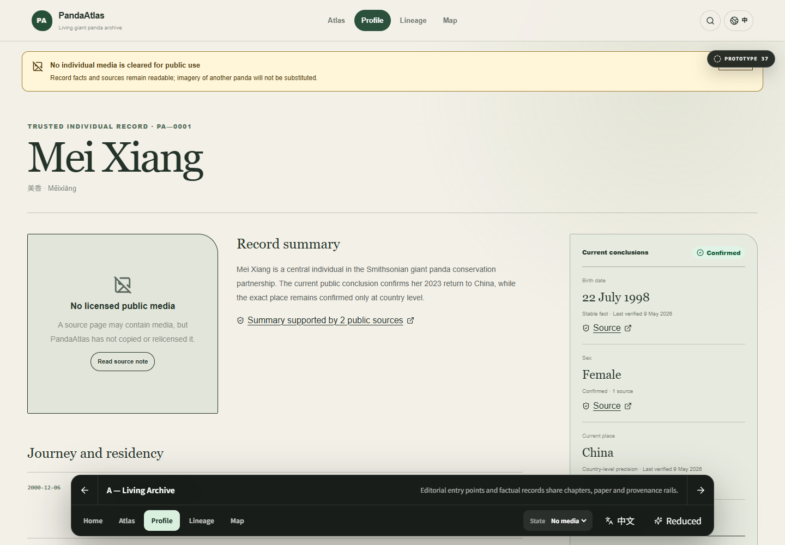
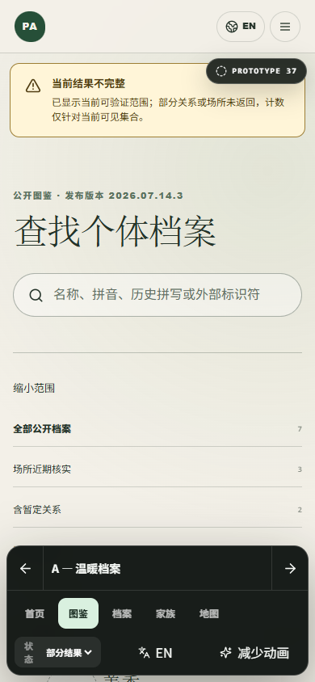
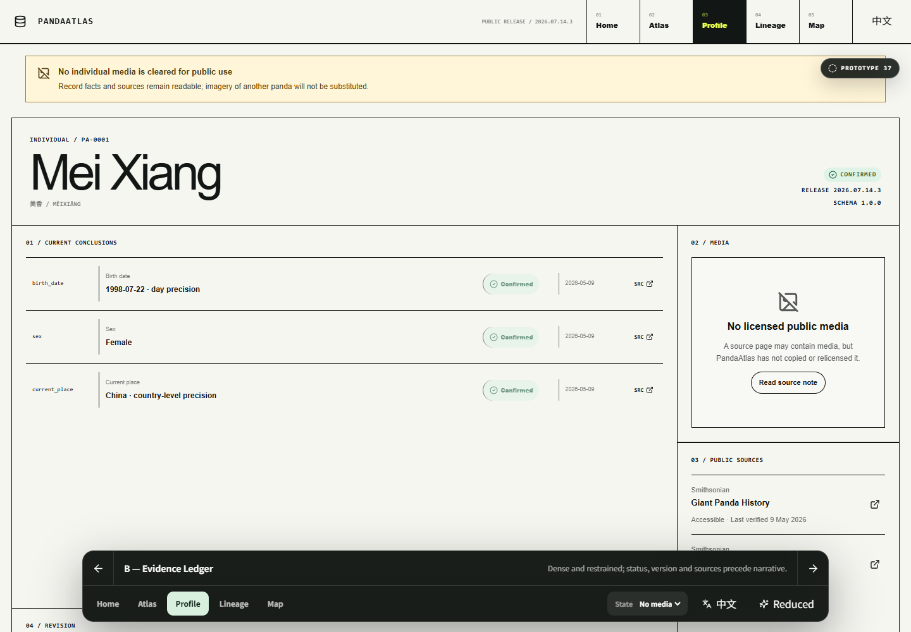
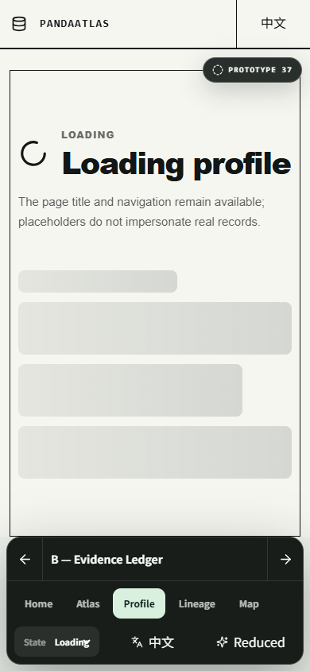
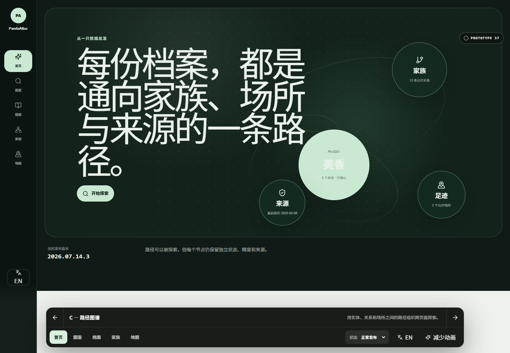
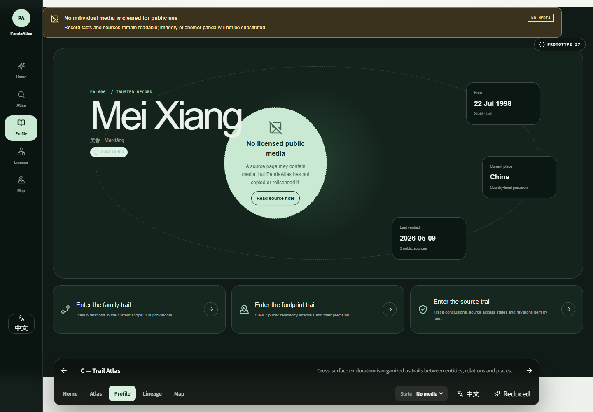
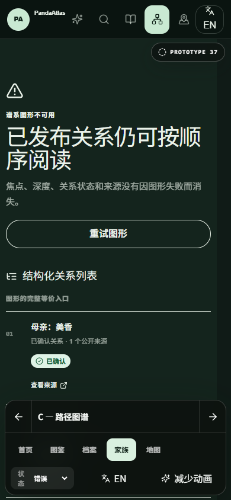

# PandaAtlas 跨 Surface 设计语言原型

> **Throwaway prototype — Issue #37.** 该分支用于回答“哪条具体设计方向最适合 PandaAtlas”，不是生产实现，不应直接合并为正式页面。

## 要回答的问题

在已经确认的信息架构、前端系统边界与内容真实性政策下，哪种具体设计方向最能同时支持：

- 首页的温暖编辑入口；
- 图鉴的搜索与结果阅读；
- 可信个体档案的事实、来源和修订；
- 家族关系的图形与线性等价入口；
- 地图 / 足迹的空间视图与结构化等价入口；
- 中英文、移动端、键盘焦点和减少动画；
- loading、empty、error、cached、partial 与 no-media。

## 运行

从仓库根目录运行：

```bash
npm --workspace web run dev
```

然后打开：

```text
http://localhost:3000/zh/prototype/cross-surface?variant=A&surface=home&state=live
```

英文入口：

```text
http://localhost:3000/en/prototype/cross-surface?variant=A&surface=home&state=live
```

## 控制方式

底部原型控制器可以切换：

- `variant=A|B|C`：设计方向；
- `surface=home|atlas|profile|lineage|map`：代表性 surface；
- `state=live|loading|empty|error|no-media|cached|partial`：UI / 交付状态；
- `motion=system|reduce`：系统动效或减少动画。

焦点不在输入控件中时，可以使用键盘 `←` / `→` 切换设计方向。所有选择都写入 URL，可刷新和分享。

## 三条方向

### A — 温暖档案 / Living Archive

**主张：** 编辑性入口和事实产品可以共享一套自然史档案语言，但事实、来源和状态通过独立轨道保持清楚。

- 首页使用编辑式分栏、档案标本和章节索引；
- 图鉴采用筛选轨道和阅读型结果行；
- 档案使用叙事正文与 sticky 事实 / 来源轨道；
- 地图与谱系保持柔和视觉，但结构化列表始终并列；
- 风险是 Editorial register 可能侵入高密度产品任务。






### B — 证据台账 / Evidence Ledger

**主张：** 版本、coverage、结论状态和来源应成为视觉结构本身，而不是内容周围的辅助说明。

- 首页像公开版本索引，而不是营销落地页；
- 图鉴使用明确列定义和筛选面板；
- 档案使用 dossier / ledger 网格；
- 地图与谱系用矩阵和结构化表作为稳定骨架；
- 风险是公共体验可能过于技术化、缺乏温度，并在移动端依赖受控横向滚动。






### C — 路径图谱 / Trail Atlas

**主张：** PandaAtlas 的独特价值是从一个个体沿关系、场所和来源继续探索，因此路径本身应成为主要构图。

- 首页用一个身份节点连接家族、足迹和来源；
- 图鉴把结果组织成可继续前进的路径；
- 档案使用身份 hub 与关系 / 足迹 / 来源入口；
- 地图与谱系最自然，但线性等价入口仍保持一等地位；
- 风险是空间构图可能提高认知负担，并让普通事实查证变慢。







## 评审时请比较

1. **首次理解：** 用户是否能立即理解这是可信大熊猫个体档案馆，而不是营销站、通用 Dashboard 或纯地图产品？
2. **移动端快速查证：** 名称、当前场所、状态、最后核实和来源是否能在狭窄视口快速找到？
3. **桌面深入探索：** 家族、足迹和来源是否支持持续探索，而不牺牲事实精度？
4. **跨 Surface 一致性：** 首页、图鉴、档案、谱系和地图是否属于同一产品，同时保留各自任务差异？
5. **真实性可见度：** confirmed / provisional、版本、coverage、cached / partial 和 no-media 是否自然融入层级？
6. **非视觉等价：** 地图或关系图失败时，结构化列表是否仍像主要产品，而不是附属错误页？
7. **双语压力：** 英文名称、较长状态说明和中英文切换是否破坏构图？
8. **实施风险：** 哪条方向最容易通过已确认的 Foundation、register、pattern 和 feature module 边界逐步实现？

## 数据和媒体边界

- 示例名称、关系、场所精度和版本号取自当前黄金数据集及已确认政策；
- 原型中的计数只描述示例发布范围，不声明现实世界总量；
- 不使用仓库中许可不明的熊猫图片；
- 所有媒体位置都故意展示 `no-licensed-media`；
- 地图几何是纯原型构图，未加载真实底图或供应商数据；
- 按钮为只读评审交互，不执行真实写操作。

## 验证记录

- `npm run typecheck`：通过；
- 原型 route 的定向 ESLint：通过；
- `next build`：通过；
- Next 生产构建确认 `/[locale]/prototype/cross-surface` 可编译；
- 截图由本机 Edge + Playwright 在桌面与 390 × 844 移动视口生成；
- 截图统一使用减少动画，以避免动效影响比较；
- 10 个桌面 / 移动渲染组合均无页面级水平溢出，底部控制器保持可见；
- 键盘 `←` / `→` 可切换方向，输入框聚焦时不会截获方向键；
- 地图和谱系失败态均保留结构化等价列表。
